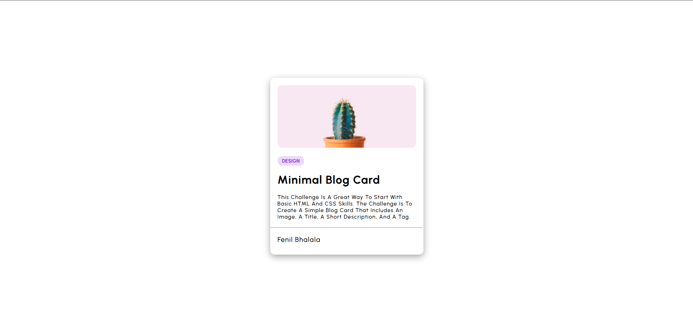

# minimal-blog-card-devchallenges
A minimal and responsive blog card layout built using HTML and CSS. This project was completed as part of the devChallenges.io HTML &amp; CSS practice series.

<h1 align="center">Minimal Blog Card By Fenil Bhalala | devChallenges</h1>

   Solution for a challenge <a href="https://devchallenges.io/challenge/minimal-blog-card" target="_blank">Minimal Blog Card</a> from <a href="https://devchallenges.io" target="_blank">devChallenges.io</a>.

  <h3>
    <a href="https://your-demo-link.netlify.app">
      Demo
    </a>
     | 
    <a href="https://github.com/FenilBhalala/minimal-blog-card-devchallenges">
      Solution
    </a>
     | 
    <a href="https://devchallenges.io/challenge/minimal-blog-card">
      Challenge
    </a>
  </h3>

---

## Table of Contents

- [Overview](#overview)
  - [What I learned](#what-i-learned)
  - [Useful resources](#useful-resources)
- [Built with](#built-with)
- [Features](#features)
- [Author](#author)

---

## 📌 Overview

This project is a clean and responsive blog card layout designed to showcase minimalist UI practices using only **HTML** and **CSS**. It was created as a part of the **devChallenges.io** series.

### 💡 What I learned
- How to structure semantic HTML5 content
- Applying custom Google Fonts (`Urbanist`)
- Responsive design using Flexbox
- Implementing interactive hover effects
- Better use of spacing, layout, and component scaling

### 🔗 Useful resources
- [Google Fonts - Urbanist](https://fonts.google.com/specimen/Urbanist)
- [DevChallenges.io Community](https://github.com/orgs/devchallenges-io/discussions)

---

## 🛠️ Built with

- Semantic HTML5
- CSS3 Custom Properties
- Flexbox
- Media Queries for Responsiveness
- Google Fonts (`Urbanist`)

---

## 🚀 Features

- Fully responsive layout for desktop, tablet, and mobile
- Clean and modern card UI
- Hover interaction for UI engagement
- Simple and minimal CSS architecture

---

## 🙋‍♂️ Author

- GitHub: [@fenilbhalala](https://github.com/FenilBhalala)
- DevChallenges Profile: [Fenil Bhalala](https://devchallenges.io/profile/15f31578-a92d-402a-ba23-7f252e7b5e69)
